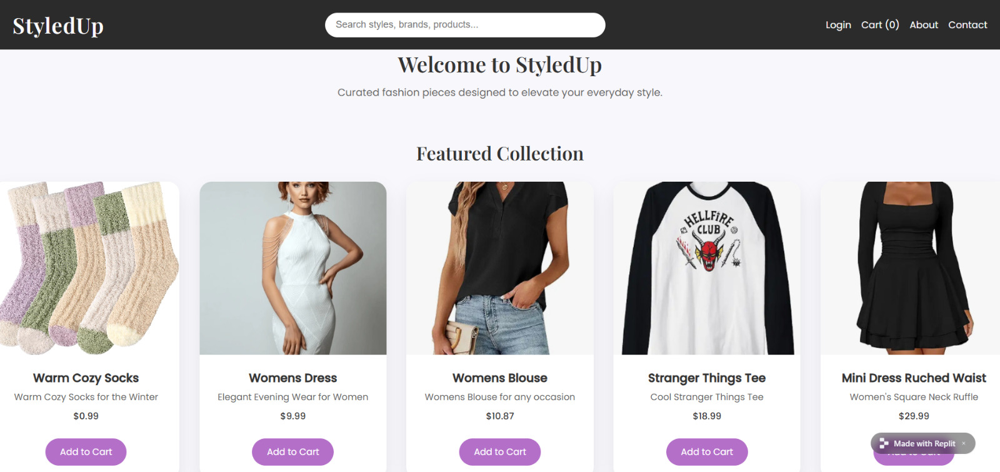
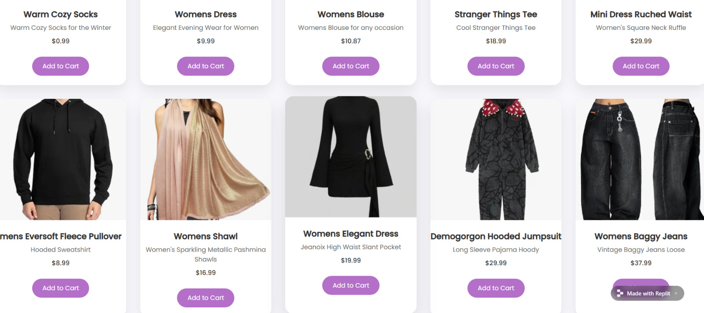
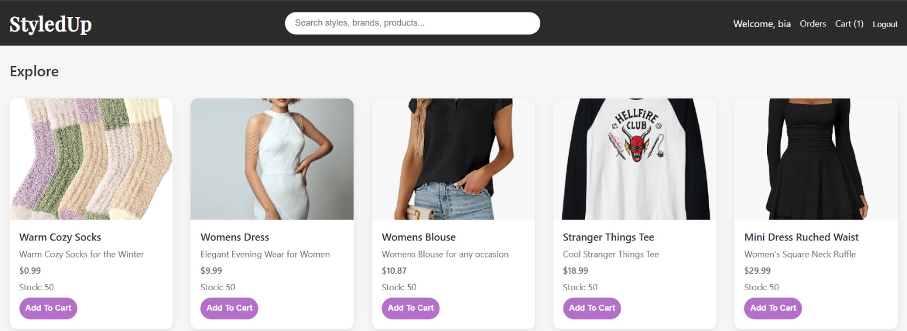
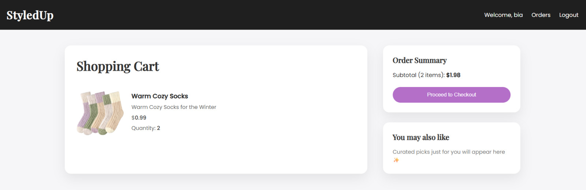
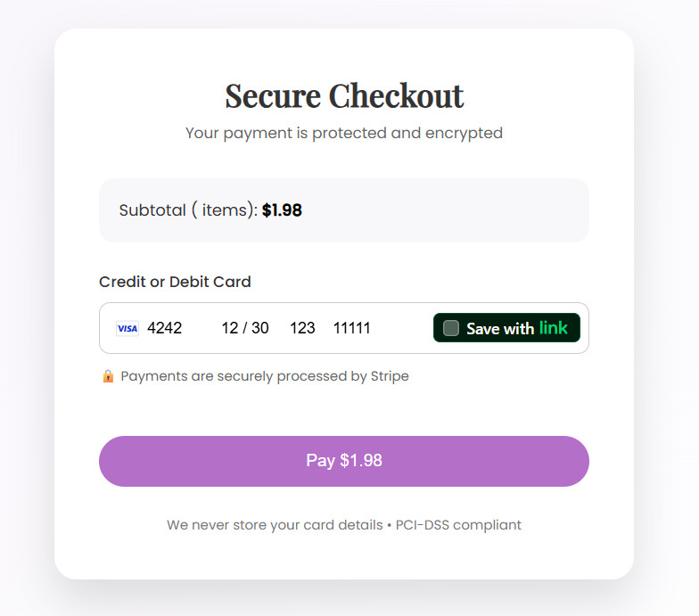
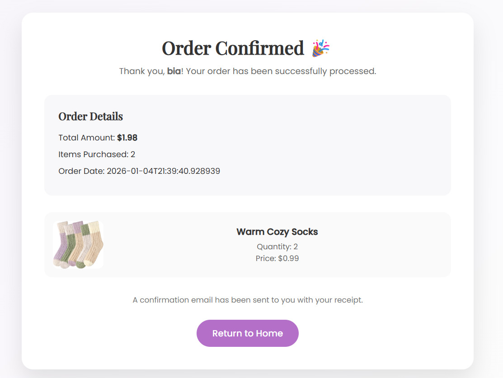
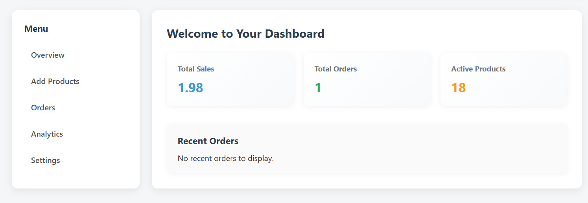
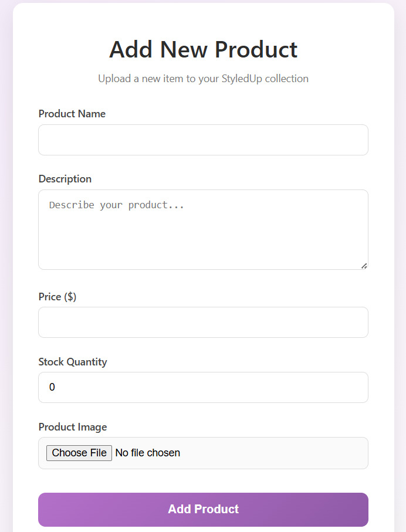

# StyledUp

StyledUp is a full-stack e-commerce web application created as a personal portfolio project. The goal of this project was to design and implement a realistic shopping experience while gaining deeper, hands-on experience with backend web development using Spring Boot.

The application supports product browsing, cart management, checkout, and secure payment processing, while following clean architecture principles and best practices.

---

## Tech Stack

- **Java**
- **Spring Boot**
- **Spring MVC**
- **Spring Security**
- **Hibernate / JPA**
- **Servlets**
- **HTML5**
- **CSS3**
- **JavaScript**
- **Thymeleaf**
- **MySQL**
- **Stripe API**

## Live Demo
Check out the app here: [StyledUp on Replit](https://styled-up-ecommerce-plaform-1--AishaForrester.replit.app)

## Landing Page

- Allows users to browse products and optionally signup/log into the platform
- Allows users to view about and contact information

## Home Page

- Allows users to browse products, view orders and add products to cart

## View Cart Page

- Allows users to view their cart

## Checkout Page

- Enter billing information 
- Proceed to secure Stripe payment 

## Order Confirmation Page

- Connfirms the purchase of the user

## Orders Page

- Displays the user's order history

## Seller's Home Page

- Displays information such as the total sales and orders related to seller

## Seller's Add Product Page

- Enter product deatils which will be added to the database and displayed on the landing and home page of users

## Features

- User login and registration
- Product browsing and search
- Seller dashboard for managing products
- Secure payments via Stripe

---

## Improvements / Future Work

- Display seller’s active products
- Track order status
- Allow item removal from cart
- Add product search filters
- Enhance UI/UX

---
## Certification
Board Infinity Building Applications with Spring Boot and MVC Architecture

---

## Getting Started

1. Clone the repository (git clone <repo-url>)

2. Clone the repository

3. Configure your database in application.properties

4. cd styledup ./mvnw spring-boot:run

